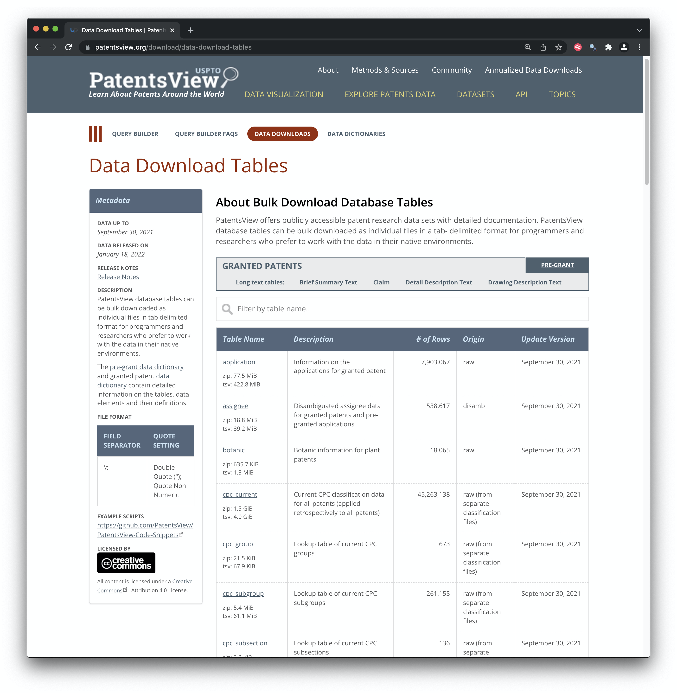

<!-- README.md is generated from README.Rmd. Please edit that file -->

```{r, include = FALSE}
knitr::opts_chunk$set(
  collapse = TRUE,
  comment = "#>",
  fig.path = "man/figures/README-",
  out.width = "100%"
)
```

# PatentsViewData

<!-- badges: start -->
<!-- badges: end -->

The goal of patentsviewdata R package is to make it easier to download the data files from the United States Patent and Trademark Office (USPTO) [PatentsView service](https://patentsview.org/download/data-download-tables). The data download service involves multiple and often large data files that allow a user to construct the complete US patent collection in a form that is useful for data science. 

The `patentsview` data package has been developed as part of the WIPO patent analytics team's efforts to make patent data more accessible. It also complements the open access [patentsview API package](https://docs.ropensci.org/patentsview/index.html) that is accessible from [rOpenSci](https://ropensci.org/) and is on CRAN. If you don't need the full USPTO data we suggest that you use the [PatentsView API package](https://docs.ropensci.org/patentsview/index.html).

This package has been developed by Paul Oldham as part of the work of the WIPO Patent Analytics team. You can find out more about that work on the [WIPO Patent Analytics website](https://wipo-analytics.github.io/) including a post with [a step by step guide](https://wipo-analytics.github.io/posts/2022-01-11-patentsview-bulk-data/) on how the functions were written. 

## Installation

You can install the development version of patentsviewdata from [GitHub](https://github.com/) with:

``` r
# install.packages("devtools")
devtools::install_github("poldham/patentsviewdata")
```

## Examples

There are three main functions in the package.

1. pv_meta()
2. pv_download()
3. pv_import()

### pv_meta()

pv_meta() access the patentsview metadata table for applications or grants on the website. The function fetches either the application or the [grant table](https://patentsview.org/download/data-download-tables) that you can see below. It also does some tidying up on the data to make it easier to access the data for download and to document your datasets. 

```{r echo=FALSE}

```
For the applications (pregrants) and the grants page these tables are downloaded either to your working directory or to a destination you specify as follows. If the destination folder does not already exist it will be created. We recommend that you specify a grants and pregrant or applications folder. It will make life a lot simpler later on. 

```{r, eval=FALSE}

applications_meta <- pv_meta(type = "application")
grants_meta <- pv_meta(type = "grant")

# or make your life easier and specify a destination

applications_meta <- pv_meta(type = "application", dest = "applications")
grants_meta <- pv_meta(type = "grant", dest = "grants")
```


When you have the meta data files you are then able to download the files. The key here is to provide the url or a vector of urls for the file you are interested in. Again you can specify a location for the download. 

### pv_download()

As there are a number of large files and internet connections vary there is a risk that the connection will time out. This is handled by the timeout funtion. This is set to 600 seconds (10 minutes) by default but you may want to change this depending on your connection speed. 

We now want to download a single file from the grants table. Note that you do not have to specify a destination folder (it will be created if it does not exist) but it is strongly recommended. If you are downloading the entire collection of applications and grants this will turn into a lot of files with similar names fast. 

```{r eval=FALSE}

pv_download(grant_meta$url[1], dest = "grants") 


```

In the message you will see that the directory is created if it doesnt exist and you will see information about the size of the data. 

>ℹ 'grants' dir created
> trying URL 'https://s3.amazonaws.com/data.patentsview.org/download/application.tsv.zip'
Content type 'binary/octet-stream' length 81275891 bytes (77.5 MB)
==================================================
downloaded 77.5 MB


### pv_import()


Once we have downloaded a file we can import it with `pv_import()`. As the files are zipped we do not download them directly into an R object and your environment memory will fail if you try and do that with all the files anyway. 

We then import the file. Note here that we are importing the applications file listed with the grants table not the pregrant table which also contains an applications table (so choose destinations and names accordingly).

```{r eval=FALSE}
applications <- pv_import("grants/application.tsv.zip")
```

PatentsView data files are tab delimited. The PatentsView team have done a great job in providing individual file import scripts in R and Python in a [GitHub code snippets repo](https://github.com/PatentsView/PatentsView-Code-Snippets/tree/master/03_bulk_download_read_in). You can find the full set of R scripts [here](https://github.com/PatentsView/PatentsView-Code-Snippets/tree/master/03_bulk_download_read_in/R%20Scripts).

In developing the package we have focused on consolidating imports using the vroom package. However, if you run into problems we recommend reviewing the [R import scripts](https://github.com/PatentsView/PatentsView-Code-Snippets/tree/master/03_bulk_download_read_in/R%20Scripts) created by the PatentsView team and if that doesnt work using `data.table::fread()` to figure out how to import the table.

We recommend that you familiarise yourself with a few of the files before going all the way and downloading everything. 

### Downloading Multiple Files

You should think about what files you might actually want. If you download all files (including descriptions and claims and brief summary) you will need about 128Gb of space for the zipped files. Individual description files may go up to nearly 4Gb but most data files are a lot smaller than that. 

So, make sure you have plenty of disk space.

We will illustrate by creating a small vector or urls (the first two urls in the grants_meta table.

```{r eval=FALSE}
small <- grants_meta$url[1:2] # take the first two urls

# pass this into `pv_download()`

pv_download(small, dest = "grants", timeout = 600)

```

Once the files are downloaded they will be ready to be imported. 

Note that the `pv_download()` function is designed to skip to the next url if the timeout is reached. This can mean that a file download may be incomplete after 10 minutes (timeout = 600) and the function will skip on. 

It is therefore important when importing to check that you are getting the number of rows of data that are recorded in the meta data table under `number_of_rows()` (in the absence of a check sum). We can handle this in the import function by specifying our meta data data.frame (which needs to be loaded in your environment). For example, if we import one of the files we just downloaded and specify the path to the metadata table (saved as .rds by the `pv_meta()` function) we will receive an informative message on whether the rows match. If the row count does not match then you will receive a suggestion to try the PatentsView code snippets and if that fails `datatable::fread()`.

```{r eval=FALSE}
library(tidyverse)

# import the file
grants_assignees <-  pv_import("grants/assignee.tsv.zip", meta_path = "grants/grant_meta.rds")

```
- ✓ Number of Rows Matches the expected 538617 for 'assignee' in the metadata file file

### Saving files as different types

The PatentsView team have done a great job in making the data available in a form that can be readily accessed by data scientists. However, we may want to save the downloaded data in different file formats to suit our needs. For example, we might want to use the newish `qs` package to save smaller files in the super fast `qs` format, save as standard `rda` or `rds` or save into parquet to use on an Apache Spark cluster. These options are handled in the `save_as` argument. 

```{r eval=FALSE, message=TRUE}
library(patentsviewdata)
grants_assignees <-  pv_import("grants/assignee.tsv.zip", meta_path = "grants/grant_meta.rds", 
                               dest = "grants", save_as = ".qs")

# or

grants_assignees <-  pv_import("grants/assignee.tsv.zip", meta_path = "grants/grant_meta.rds", 
                               dest = "grants", save_as = ".parquet")
```

For each file save you will then see messages. 

-    ✓ Number of Rows Matches the expected 538617 for 'assignee' in the metadata file file
-    ✓ saved data to 'grants/assignee.parquet'

To import a file in the newish superfast `qs` format we would choose:

```{r  eval=FALSE,message=FALSE, warning=FALSE}
library(qs)

assignee <- qread("grants/assignee.qs")
```

Note that `qs` functions are not intended to be used with very large datasets (but are benchmarked on datasets with 5 million rows and 115Mb) so be aware of this.

Parquet files are written using the `arrow` package and can be read as follows. 

```{r, eval=FALSE, message=FALSE, warning=FALSE}
library(arrow)

assignee <- read_parquet("grants/assignee.parquet")
```


